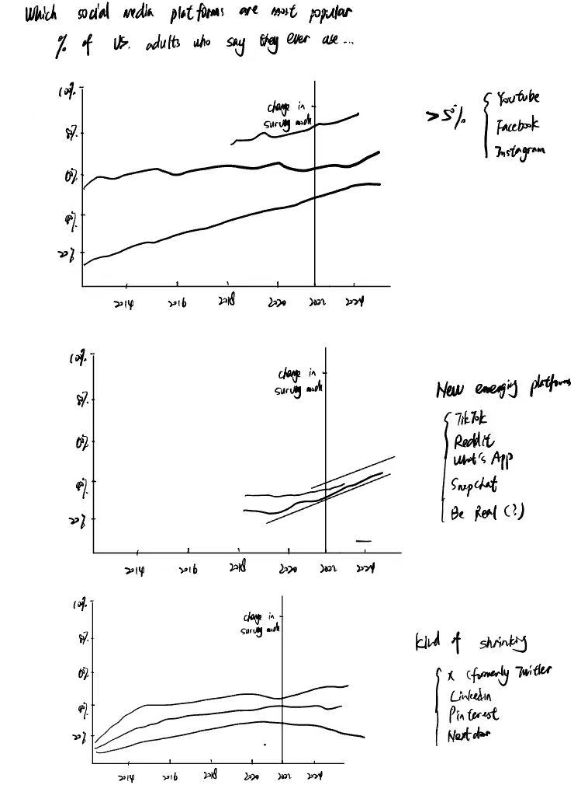
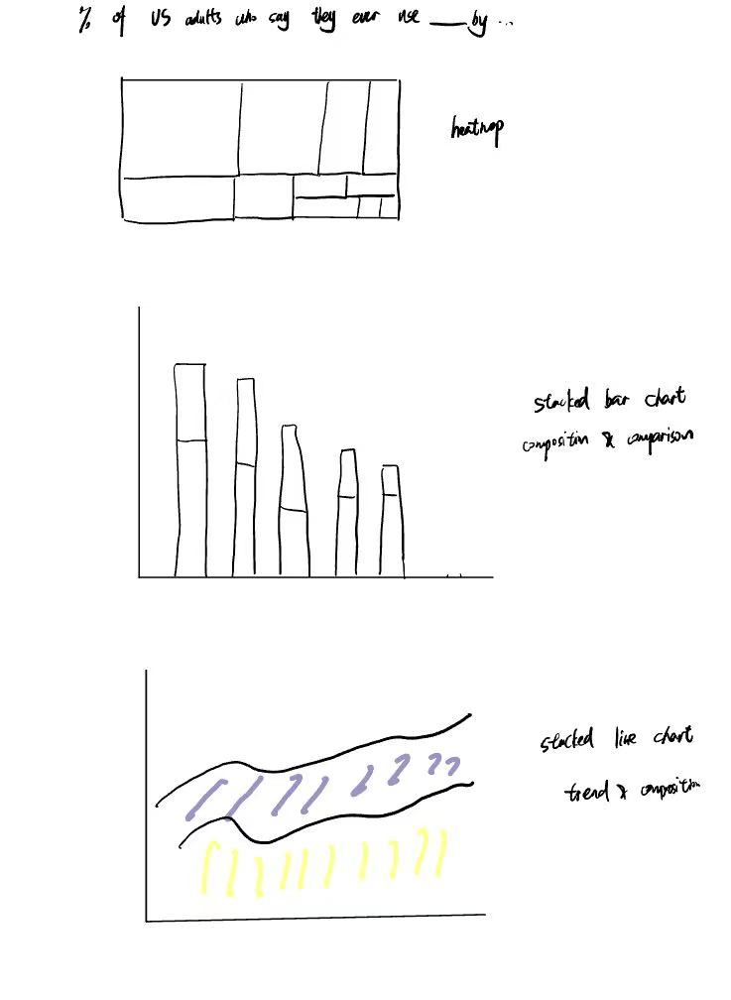
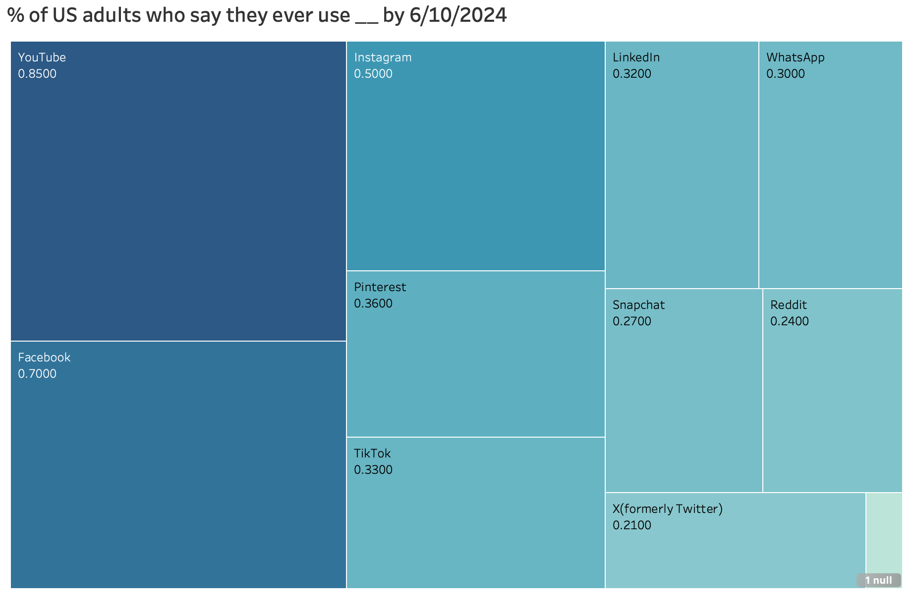

| [home page](https://myrashen.github.io/Shihan-Shen-portfolio/) | [data viz examples](dataviz-examples) | [critique by design](critique-by-design) | [final project I](final-project-part-one) | [final project II](final-project-part-two) | [final project III](final-project-part-three) |

# Critique by Design on Demographics of Social Media Users  

## Step one: the visualization

The initial data visualization link: [Demographics of Social Media Users](https://www.pewresearch.org/internet/fact-sheet/social-media/?tabItem=3345cffa-94a6-4e74-9272-70dee1e0e213#who-uses-each-social-media-platform)

Before looking further on the data visualization, I think this topic is very useful because many Americans use social media to connect with one another, engage with news content, share information and entertain themselves. 

The primary audience, I suppose, are mainly the policy makers and analysts those studying the impact of social media. Besides, I thought it was also useful for business leaders and strategists. Through the demographic analysis of social media users, policy analysts can analyze the public opinions and propoganda. Companies can decide where to allocate marketing budgets and resources, such as  advertising. 

However, I think this visualization is not effective for reaching those audiences. The visuals are static and lack storytelling. It merely displayed the data collection, with no further explanation or any narratives related to meaningful storytelling.

## Step two: the critique

I began the critique by design on demographics of social media users by critically evaluating the initial data visualization using Stephen Few's Data Visualization Effectiveness Profile. I focused on perceptibility, aesthetics, and engagement in conveying insights about social media users' engagement trends. 

This data visualization did well in credibility and clarity. I can approach to its data source on the URL. It has several notes explaining some specific data point, such as the vertical line in the chart, indicating a change in survey mode. On this web page, there is a board, "HOW WE DID THIS", explaining its methodology, purpose and survey questions as supplemental information.

However, this data visualization were really bad in the aesthetics and engagement. It solely uses charts and tables to visualize the percentage of social media users in demographic perspectives.  Besides, the visuals are purely functional, with no interactivity, designs, or storytelling elements. Users can’t filter, compare, or explore the data beyond what is given. A key realization was that while the original visualization presented interesting data points, it lacked a clear narrative, making it difficult for viewers to extract meaningful conclusions at a glance. Additionally, the color scheme and labeling needed improvement for better readability.

I would at least change the form of charts, making it more visible and showing more on social media trends. Besides, I would add an interactive function, such as filters.

## Step three: Sketch a solution

Explanations:
With the critique in mind, I moved to sketching potential redesigns. I explored different visual formats, including line charts to depict trends over time, scatter plots to show correlations, and bar charts to highlight the most engaged users. In my initial design, instead of overwhelming and colorful lines, I decided to divide the twelve lines into three groups:
1) Dominant platforms with over 50% engagement now.
2) Emerging and prospect platforms with rapid growth in engagement.
3) Shrinking platforms with declining user engagement.

Explanations:
From a demographics perspective, I planned to apply stacked bar charts to show the composition of gender and age and to facilitate comparisons between various platforms. For ethnicity and education data, I opted for area charts to illustrate both the composition and trends in social media engagement across different racial and educational backgrounds. 

## Step four: Test the solution

| Question | Interview 1 | Interview 2 |
|----------|-------------|-------------|
|Can you tell me what you think this is?|student,MISM Program: the heatmap shows the engagement level of users on different platforms|student, Mid 20': the heatmap shows the comparison between platform popularity|
|Is there anything you find surprising or confusing?|student,MISM Program: the effort on dividing the overwhelming line chart into three charts|student, Mid 20': the stacked bar chart clearly represents the composition of demographic elements|
|Is there anything you would change or do differently?|student,MISM Program: add some cross-platform analyses|student, Mid 20': add filter function for clearity|

Synthesis: 
I think my solution is clear for the audience to have a glance at. Based on the feedback, I think incorporating a cross-platform analysis is helpful to understand social media users'preferences between different platforms. Besides, a filter function could be added for better clarity and customization, allowing users to focus on specific demographics or trends.

## Step five: build the solution

_Include and describe your final solution here. It's also a good idea to summarize your thoughts on the process overall. When you're done with the assignment, this page should all the items mentioned in the assignment page on Canvas(a link or screenshot of the original data visualization, documentation explaining your process, a summary of your wireframes and user feedback, your final, redesigned data visualization, etc.)._

The graph is a treemap visualization that illustrates the percentage of U.S. adults who report using various social media platforms as of June 10, 2024. The purpose of the graph is to provide a comparative overview of social media platform usage among U.S. adults, emphasizing the relative popularity of different platforms.

## References
"Data Visualization Effectiveness Profile", Stephen Few,*Perceptual Edge*, *Visual Business Intelligence Newsletter*, 2017.
