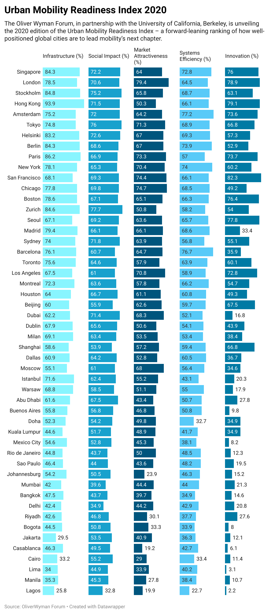

| [home page](https://cmustudent.github.io/tswd-portfolio-templates/) | [data viz examples](dataviz-examples) | [critique by design](critique-by-design) | [final project I](final-project-part-one) | [final project II](final-project-part-two) | [final project III](final-project-part-three) |

# Data visualization examples
## Assignment: [Data Viz Redesign](Data-viz-redesign)
 

## Assignment: [Demo_2025](demo_2025)
 

   <noscript></noscript>
   <object class='tableauViz'  style='display:none;'>
      <param name='host_url' value='https%3A%2F%2Fpublic.tableau.com%2F' />
      <param name='embed_code_version' value='3' />
      <param name='site_root' value='' />
      <param name='name' value='governmentdebt&#47;barchart2' />
      <param name='tabs' value='no' />
      <param name='toolbar' value='yes' />
      <param name='static_image' value='https:&#47;&#47;public.tableau.com&#47;static&#47;images&#47;go&#47;governmentdebt&#47;barchart2&#47;1.png' />
      <param name='animate_transition' value='yes' />
      <param name='display_static_image' value='yes' />
      <param name='display_spinner' value='yes' />
      <param name='display_overlay' value='yes' />
      <param name='display_count' value='yes' />
      <param name='language' value='en-US' />
   </object>

## Assignment: [Government Debt](government_debt)

   <noscript></noscript>
   <object class='tableauViz'  style='display:none;'>
      <param name='host_url' value='https%3A%2F%2Fpublic.tableau.com%2F' />
      <param name='embed_code_version' value='3' />
      <param name='site_root' value='' />
      <param name='name' value='governmentdebt_17380279130950&#47;part3' />
      <param name='tabs' value='no' />
      <param name='toolbar' value='yes' />
      <param name='static_image' value='https:&#47;&#47;public.tableau.com&#47;static&#47;images&#47;go&#47;governmentdebt_17380279130950&#47;part3&#47;1.png' />
      <param name='animate_transition' value='yes' />
      <param name='display_static_image' value='yes' />
      <param name='display_spinner' value='yes' />
      <param name='display_overlay' value='yes' />
      <param name='display_count' value='yes' />
      <param name='language' value='en-US' />
      <param name='filter' value='publish=yes' />
   </object>

