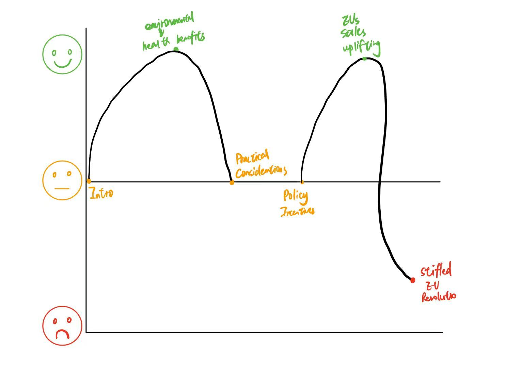
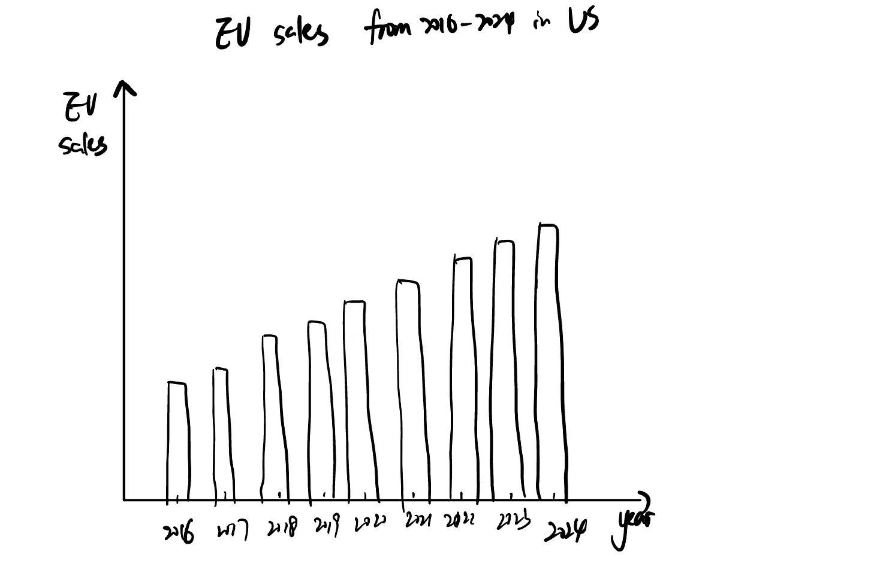
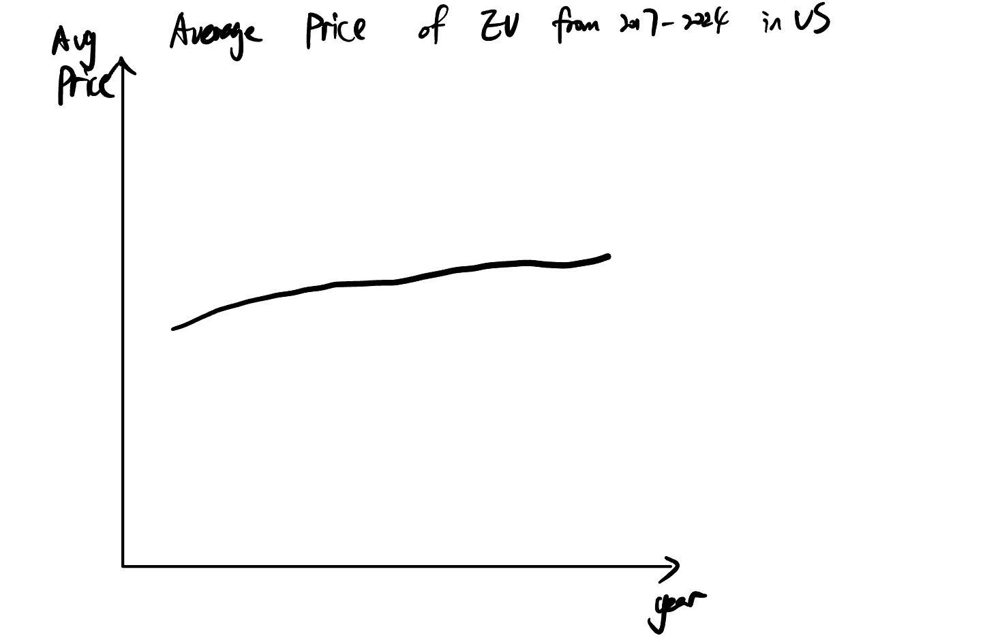
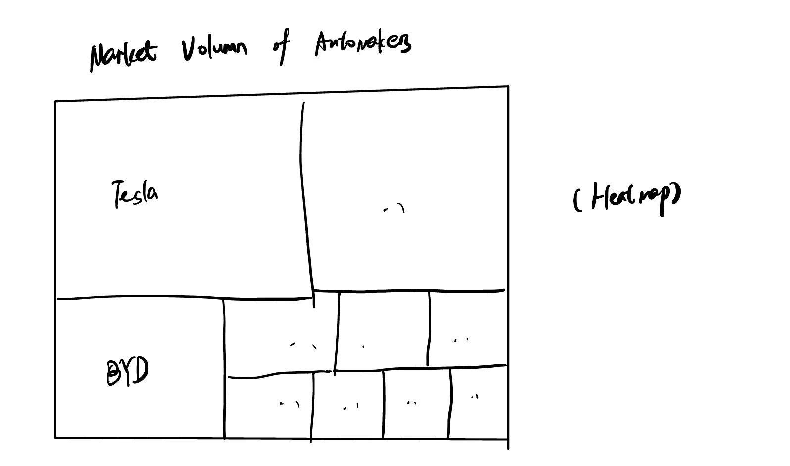
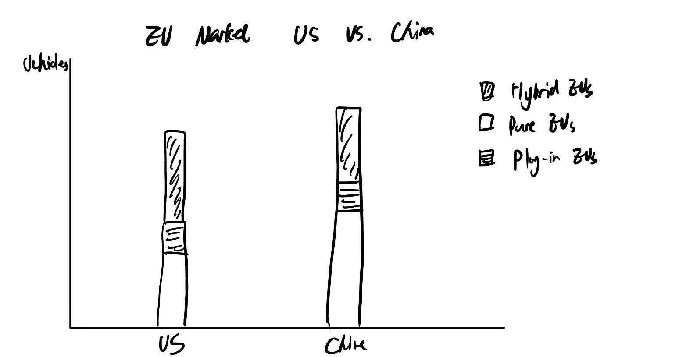
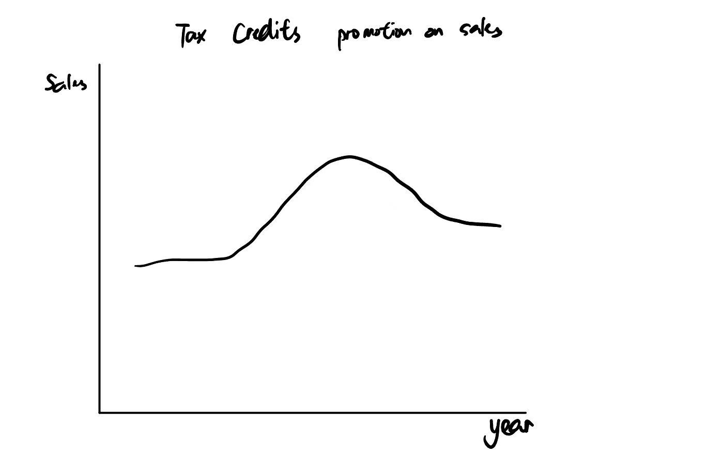

# Final Project Part One

| [home page](https://myrashen.github.io/Shihan-Shen-portfolio/) | [data viz examples](dataviz-examples) | [critique by design](critique-by-design) | [final project I](final-project-part-one) | [final project II](final-project-part-two) | [final project III](final-project-part-three) |

# Outline 
 
## HIGH-LEVEL SUMMARY:
The transition to electric vehicles (EVs) in the U.S. has been shaped by a complex interplay of government policies, consumer preferences, and market forces. While federal and state tax incentives have played a crucial role in encouraging EV adoption, recent shifts in policy—such as potential changes to EV tax credits—have raised concerns about the future growth of the market. 

## AIM:

As a reader, I want to know the reason why EVs market in US isn't booming as that in China so that I can make an informed decision about whether purchasing an EV is financially and practically viable for me. 

## STRUCTURE:

- Overall Narrative: What the EVs market and transition in US looks like?
- Specific Questions: 1) Practical Considerations for consumers; 2) Policy of EV tax credits
- Call to Action: 1) Policy Makers; 2) Consumers; 3) Automakers

## Initial sketches

# The data

| Name | URL | Description |
|------|-----|-------------|
|EVs Overview|https://www.statista.com/outlook/mmo/electric-vehicles/worldwide|Several highlights in EVs Revolution worldwide.|
|U.S. quarterly battery electric vehicle sales|https://www.statista.com/statistics/1231872/battery-electric-vehicle-sales-in-the-united-states/|U.S. EVs sales market booming|
|Incentives available for electric-only vehicle owners|https://www.statista.com/statistics/1325815/us-incentives-available-for-electric-only-vehicle-owners-that-owners-are-aware-of/|A survey carried in the U.S. of the tax rebates or discounts.|
|Brand Market Share|https://www.ceicdata.com/en/united-states/electric-vehicle-sales-by-brand-and-model-ytd|Each Brand Share|
|TBD|

I will display the project from the data source above from three perspectives: 1) Overview of EVs Revolution (e.g. sales booming, brand share); 2) Customers' choices (e.g. average price of EVs, incentives to purchase) 3) Policy effects (e.g.Tax credits policy). By applying the data, I aim to tell a story about the EVs Revolution and its practical obstacles and policy implications.

# Method and medium

I will use **Shorthand** to plot my story. To tackle with data, I would use **Tableau Prep** for data cleaning to ensure datasets are aligned in terms of timeframes and formats. For data visualization, I would use **Tableau Desk** to create an interactive dashboard to make the story more engaging.

## References
“A Revolution Stalls.” The Economist 449, no. 9374 (December 2,2023). https://www.proquest.com/docview/2895469049/abstract/8FB085553A0E434EPQ/12.

“Auto Industry’s Shift toward EVs Is Expected to Go on despite Trump Threat to Kill Tax Credits | AP News.” Accessed December 3, 2024. https://apnews.com/article/electric-vehicles-tax-credits-cars-trump-autos-4751a8f9c5a410126d503b4af7f54285.

Christensen, Jen. “Switching to Electric Vehicles Could Save Hundreds of Young Lives and Prevent Millions of Illnesses, Report Says.” CNN, February 21, 2024. https://www.cnn.com/2024/02/21/health/electric-vehicles-air-pollution-kids/index.html.

Yoon, June. “Donald Trump’s Plans Threaten the EV Transition.” Financial Times, November 27, 2024, sec. Business Insight. https://www.ft.com/content/e8f623e1-c75a-478e-ad8f-aa5b05ef6aa0.

